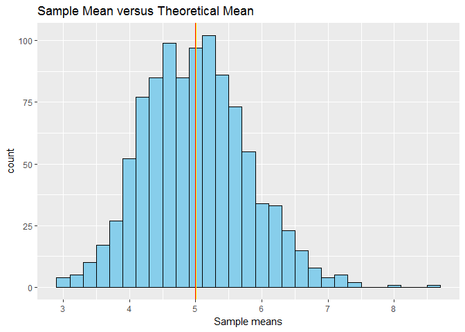
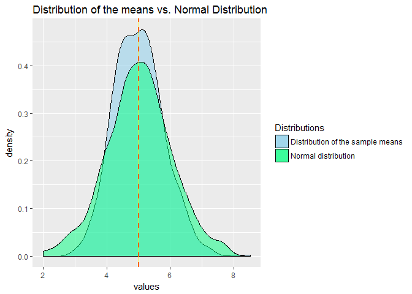

###Overview
* * *
In this project we will investigate the exponential distribution in R and compare it with the Central Limit Theorem. Our project investigates the distribution of averages of 40 exponentials distributions over 1000 simulations. The mean of exponential distribution is 1/lambda and the standard deviation is 1/lambda.

###Simulation
* * *
We simulate the exponential distribution using R `rexp()` function and use `ggplot2` package to compare its properties.
At first, we should to load required packages, set up seed and other parameters values. 


```r
set.seed(12031987)
library(ggplot2)

lambda <- 0.2
sims.n <- 1000
n <- 40
```

Then we do **1000** simulations of **40** exponentials and calculate their means. 

```r
sims.exp <- replicate(sims.n, rexp(n, lambda))
sims.exp.means <- colMeans(sims.exp)
```

###Q1 Sample Mean versus Theoretical Mean
* * *

The difference between the sample mean **(5.0069177)** and theoretical mean **(5)** is **0.0069177**. It is a very small value cause their values are very close and it was be expected. Lets visualize the difference by two vertical lines per each mean on the histogram.

<!-- -->

###Q2 Sample Variance versus Theoretical Variance
* * *

The difference between the sample variance **(0.619896)** and theoretical variance **(0.625)** is **-0.005104**. In this case, the sample variance is **less** than theoretical variance, but the difference between their values are also very small. And according **the Central Limit Theorem** sample variance will be closer to theoretical variance as we increase our sample size.  

###Q3 Distribution
* * *
As we already know from the Central Limit Theorem distribution of the means should looks like more similar to normal distributions. And this process depends on numbers of iteration. And it is clearly seen in the visualization below:   


<!-- -->

###Appendices
* * *

Q1 code listing:

```r
sample.mean <- mean(sims.exp.means)
theory.mean <- 1/lambda
```

```r
ggplot(as.data.frame(sims.exp.means), aes(x=sims.exp.means)) +
     geom_histogram(binwidth = .2, color = "black", fill = "skyblue") + 
     geom_vline(xintercept = sample.mean, color = "yellow") +
     geom_vline(xintercept = theory.mean, color = "red") +
     labs(title = "Sample Mean versus Theoretical Mean", x = "Sample means")
```

Q2 code listing:

```r
sample.var <- var(sims.exp.means)
theory.var <- ((1/lambda)^2)/n
```

Q3 code listing:

```r
sims.norm <- rnorm(sims.n, mean=1/lambda)
```

```r
ggplot(as.data.frame(sims.exp.means), aes(x=sims.exp.means, fill = "skyblue")) +
     geom_density(alpha= .5) + 
     geom_density(data = as.data.frame(sims.norm), aes(sims.norm, fill = "springgreen"), alpha= .5) +
     geom_vline(xintercept = sample.mean, linetype = "dashed", color = "red", size = 1) +
     geom_vline(xintercept = 1/lambda, color = "yellow", size = .5) + 
     labs(title = "Distribution of the means vs. Normal Distribution", x = "values") + 
     scale_fill_identity(name = "Distributions", 
                         guide = "legend",
                         labels = c("Distribution of the sample means", "Normal distribution"))
```

You can find the project .Rmd file in my github repository by clicking this [url](https://github.com/armandyne/Statistical-Inference-Course-Project)
